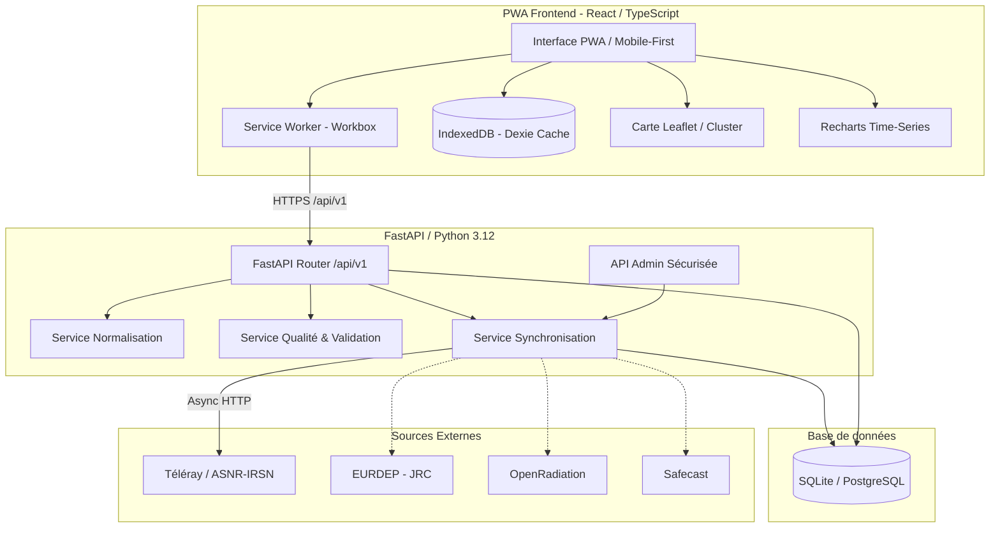

# Architecture Technique — RADIATOR (Radiation France)

L'application **Radiation France (RADIATOR)** est une Progressive Web App (PWA) scientifique conçue pour la consultation résiliente et temps réel de la surveillance radiologique environnementale.

## Diagramme d'Architecture

## Stratégie de Résilience Hors Ligne (PWA & Offline)

1. **Assets statiques (HTML/JS/CSS/icônes)** : *Cache-First* via Service Worker Workbox.
2. **Tuiles cartographiques OpenStreetMap** : *Cache-First* avec expiration à 7 jours (jusqu'à 500 tuiles).
3. **Données de l'API (`/api/v1/*`)** : Stratégie *Network-First* avec bascule instantanée sur IndexedDB (Dexie).
4. **Indicateur de fraîcheur** : L'interface avertit explicitement lorsque les données présentées proviennent du cache avec l'horodatage exact.

## Principes Déontologiques et Scientifiques

- **Pas d'alarme arbitraire** : Le fond radiologique naturel français oscille naturellement entre 50 et 250 nSv/h (jusqu'à 350+ nSv/h en Bretagne, Massif Central et Corse granitique). Les couleurs et jauges respectent ces ordres de grandeur sans dramatisation visuelle.
- **Préservation des données brutes** : `raw_value` et `raw_unit` sont rigoureusement stockées en base en parallèle des valeurs normalisées en `nSv/h`.
- **Alertes officielles uniquement** : Aucune alerte ne peut être créée par une règle de calcul locale. Seules les communications officielles publiées par les autorités habilitées (ASNR, IRSN) sont reportées.
